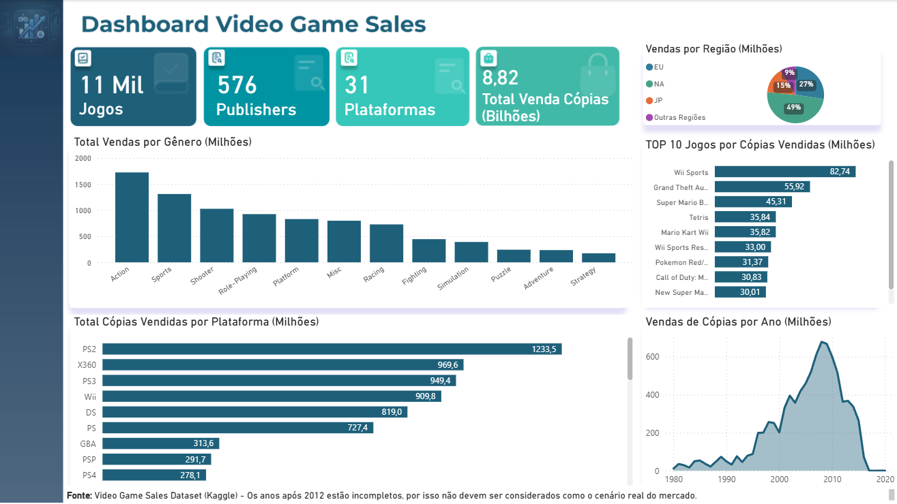

# 🎮 GameVisionAnalytics

## 📖 Sobre o Projeto

O **GameVisionAnalytics** é um projeto básico de análise de dados desenvolvido com o objetivo de simular o fluxo de trabalho de um Analista de Dados, desde o tratamento dos dados até a construção de um dashboard interativo para geração de insights.

O projeto utiliza um conjunto de dados histórico sobre vendas de videogames, passando pelas etapas de limpeza e preparação dos dados com **Python (Pandas)**, consultas utilizando **SQL Server** e **SQL**, e visualização dos resultados por meio de um dashboard desenvolvido no **Power BI**.

Além do desenvolvimento técnico, o projeto busca demonstrar boas práticas de organização, documentação e análise exploratória de dados, reproduzindo etapas comuns encontradas em projetos reais de Business Intelligence.

---

## 🎯 Objetivos

- Realizar o tratamento e a preparação dos dados para análise.
- Praticar consultas SQL aplicadas a cenários de negócio.
- Desenvolver um dashboard interativo no Power BI.
- Identificar padrões e tendências no mercado de videogames.
- Consolidar conhecimentos básicos em Python, SQL e Power BI por meio de um projeto prático.

## 🛠 Tecnologias Utilizadas

| Ferramenta | Finalidade |
|------------|------------|
| Python | Manipulação e tratamento dos dados |
| Pandas | Limpeza, exploração e transformação do dataset |
| SQL Server | Armazenamento e gerenciamento dos dados tratados |
| SQL | Consultas e análise dos dados |
| Power BI | Desenvolvimento do dashboard interativo |
| Git | Controle de versão do projeto |
| GitHub | Hospedagem e documentação do projeto |

## 🔄 Pipeline do Projeto

O projeto foi desenvolvido tentando seguir um fluxo semelhante ao utilizado em projetos de BI e Análise de Dados.

```text
Dataset CSV
     │
     ▼
Python + Pandas
(Limpeza e Tratamento dos Dados)
     │
     ▼
SQL Server
(Armazenamento dos Dados)
     │
     ▼
SQL
(Consultas e Análises)
     │
     ▼
Power BI
(Dashboard Interativo)
```

## 🧹 Tratamento dos Dados

Antes das análises, o conjunto de dados passou por uma etapa de preparação utilizando **Python** e **Pandas**.

Durante essa etapa foram realizadas as seguintes atividades:

- Identificação e tratamento de valores nulos.
- Padronização dos tipos de dados.
- Exploração inicial do dataset.
- Validação da consistência das informações.
- Preparação dos dados para importação no SQL Server.

Essa etapa garantiu maior confiabilidade para as consultas SQL e para a construção do dashboard.

## 🗄 Análises em SQL

Após o tratamento dos dados, o dataset foi importado para o **SQL Server**, permitindo a realização de consultas voltadas para análise de negócio.
As consultas também foram feitas com Pandas, mas para a inserção e prática, novamente foram feitas com SQL.

Entre as consultas desenvolvidas estão:

- Contagem de jogos, plataformas e publishers.
- Ranking dos jogos mais vendidos.
- Vendas por gênero.
- Vendas por plataforma.
- Filtros por período.
- Consultas utilizando agregações, CTEs, subconsultas e funções de janela.

Essa etapa teve como objetivo praticar consultas SQL aplicadas a cenários reais de análise de dados.

## 📊 Dashboard

O dashboard foi desenvolvido no **Power BI** com o objetivo de apresentar os principais indicadores do mercado de videogames de forma visual e interativa.

Os principais painéis incluem:

- Total de jogos.
- Total de publishers.
- Total de plataformas.
- Total de cópias vendidas.
- Distribuição das vendas por região.
- Vendas por gênero.
- Vendas por plataforma.
- Top 10 jogos mais vendidos.
- Evolução das vendas ao longo dos anos.

Além disso, todos os gráficos são interativos, permitindo explorar diferentes perspectivas dos dados por meio da seleção dos visuais.

## 🔍 Principais Insights

A análise permitiu identificar alguns padrões relevantes no mercado de videogames:

- A América do Norte representa a maior participação nas vendas globais do dataset.
- O gênero **Action** lidera em número de cópias vendidas.
- O **PlayStation 2 (PS2)** é a plataforma com o maior volume acumulado de vendas.
- **Wii Sports** aparece como o jogo mais vendido no período analisado.
- As vendas apresentam redução após aproximadamente 2012 devido às limitações do conjunto de dados utilizado.



## ⚠ Limitações do Dataset

Este projeto utiliza um conjunto de dados histórico disponível no Kaggle.

Algumas limitações importantes devem ser consideradas:

- O dataset não representa dados oficiais das fabricantes.
- Os anos mais recentes apresentam informações incompletas.
- As métricas de vendas representam **milhões de cópias vendidas**, e não receita financeira.
- Os resultados devem ser interpretados considerando o período coberto pelo conjunto de dados.

## 📁 Estrutura do Projeto

```text
GameVisionAnalytics/
│
├── images/          # Imagens utilizadas no README
├── dashboard/       # Arquivo do Power BI
├── data/            # Dados brutos e tratados
├── database/        # Scripts SQL e diagramas
├── notebooks/       # Análises em Python
├── README.md
└── .gitignore
```

## 🚀 Melhorias Futuras

Algumas melhorias que poderão ser implementadas futuramente:

- Utilizar um dataset mais atualizado.
- Criar novos dashboards focados em diferentes perspectivas do mercado.
- Automatizar o processo de atualização dos dados.
- Desenvolver análises preditivas utilizando Machine Learning.
- Adicionar conteúdos às pastas vazias que podem ser usadas futuramente.


## 📌 Conclusão

O GameVisionAnalytics permitiu aplicar, de forma integrada, conhecimentos básicos em Python, SQL, Power BI e Git durante o desenvolvimento do projeto.

Além da construção do dashboard, o projeto proporcionou experiência inicial com tratamento de dados, consultas SQL e comunicação dos resultados por meio de visualizações interativas, na tentiva de simular etapas comuns do fluxo de trabalho de um Analista de Dados.